

  

# 
HelpHub: "Uniendo talentos, creando comunidad"
 
# 
Mobile: Android native"
 
HelpHub es una plataforma de *intercambio de habilidades* comunitarias, diseñada como una iniciativa sin ánimo de lucro.

## 🎯 Objetivo
Proporcionar un entorno inclusivo donde los usuarios puedan ofrecer sus habilidades a otros miembros de la comunidad y, a su vez, reciban asistencia personalizada en áreas en las que buscan aprender o mejorar.
Este modelo de intercambio tiene como finalidad maximizar el potencial de la comunidad al unir fuerzas y fomentar el desarrollo mutuo.

## 👥 Audiencia
HelpHub está diseñado para una audiencia diversa, incluyendo:
- **Comunidad local**: Vecinos y ciudadanos que buscan colaborar entre sí.
- **Profesionales y expertos**: Compartir conocimiento y ampliar su red profesional.
- **Organizaciones sin ánimo de lucro**: Unir esfuerzos para ayudar a comunidades específicas.
- **Grupos de voluntarios**: Coordinar iniciativas y compartir habilidades dentro de sus redes.
- **Aprendices y mentores**: Fomentar relaciones de mentoría en múltiples disciplinas.
- **Emprendedores y pequeñas empresas**: Resolver necesidades puntuales y colaborar para crecer.

## 🛠️ Funcionalidades
- **Registro de Usuario con 2FA**: 🛡️ Los nuevos usuarios pueden registrarse proporcionando su información básica. Se implementa un sistema de autenticación de dos factores (2FA) para mayor seguridad.

- **Inicio de Sesión**: 🔐 Los usuarios pueden iniciar sesión con su correo y contraseña. Compatibilidad con el sistema 2FA para confirmar la identidad del usuario en cada inicio de sesión.
 

  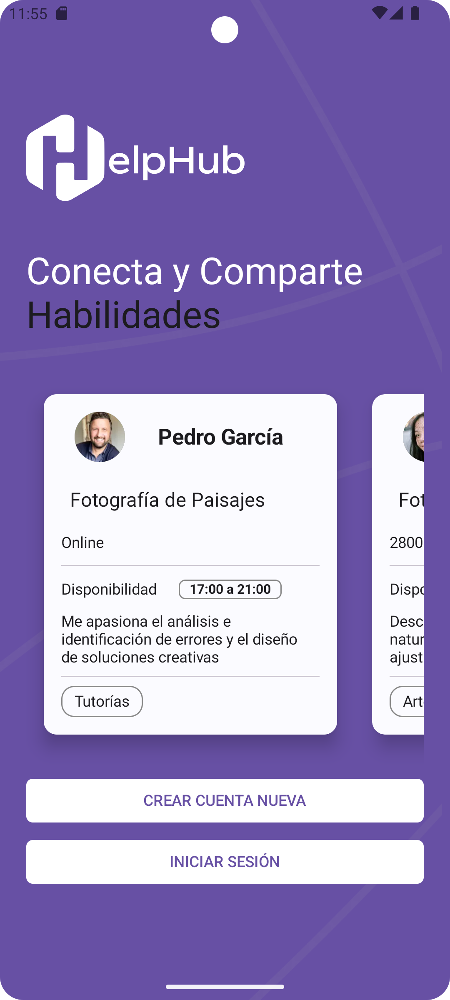
  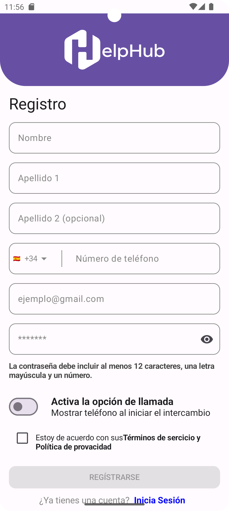
  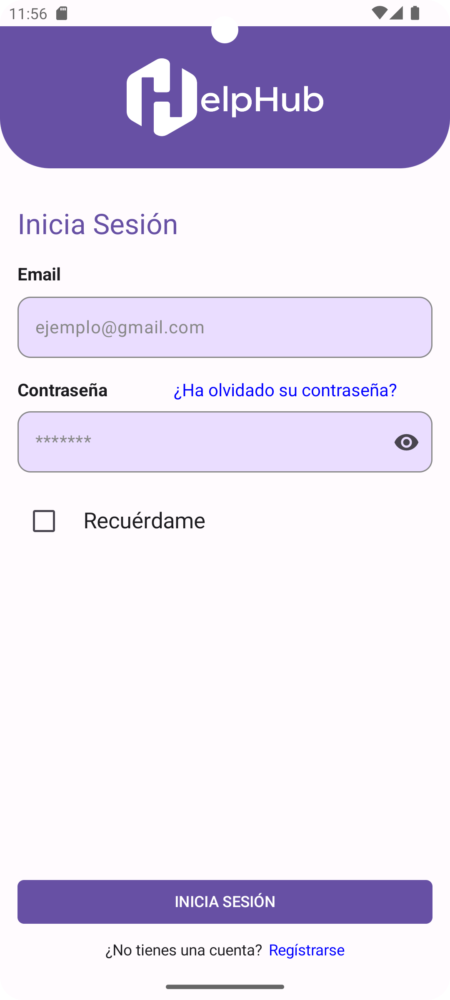
  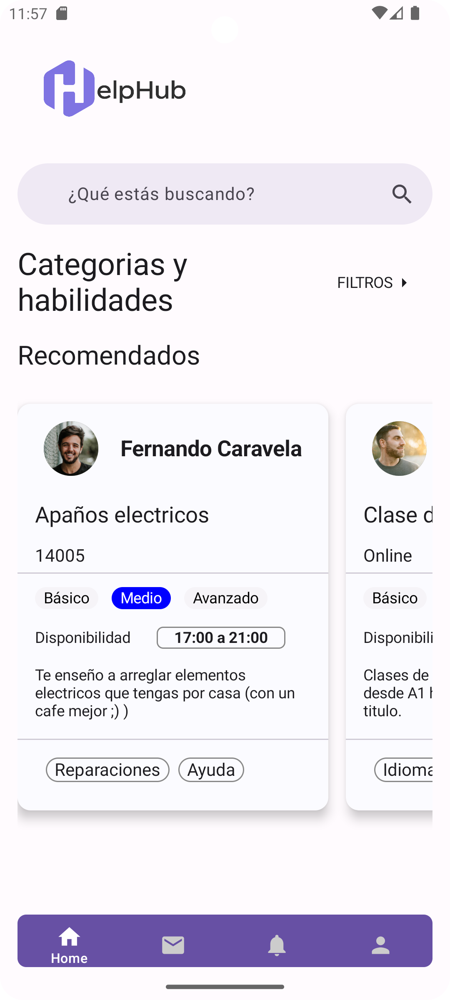

- **Perfil**: 👤 Los usuarios pueden crear, editar, ver y eliminar su perfil personal.
  

  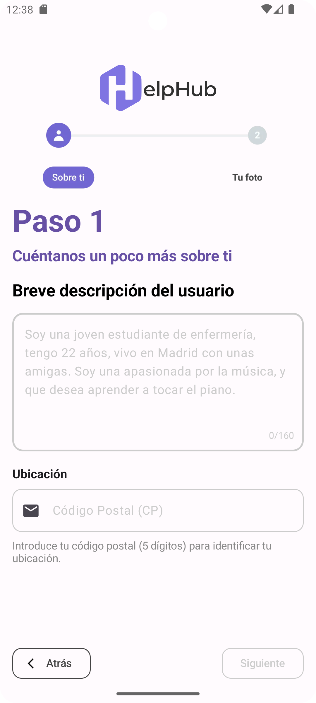
  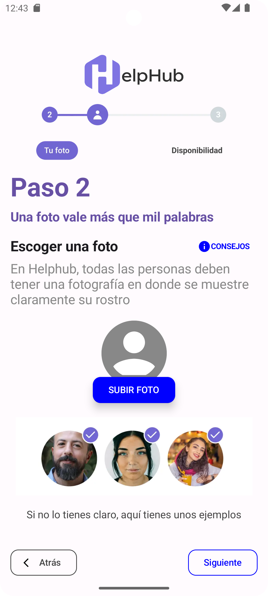
  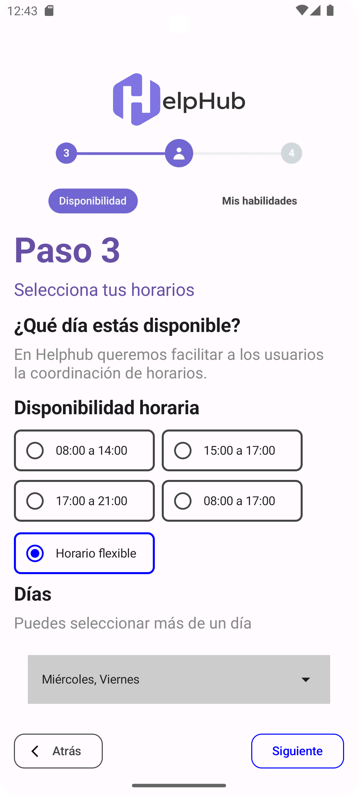
  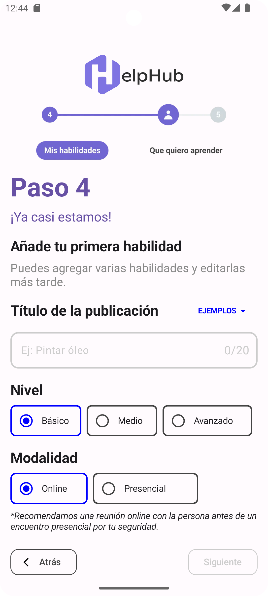
  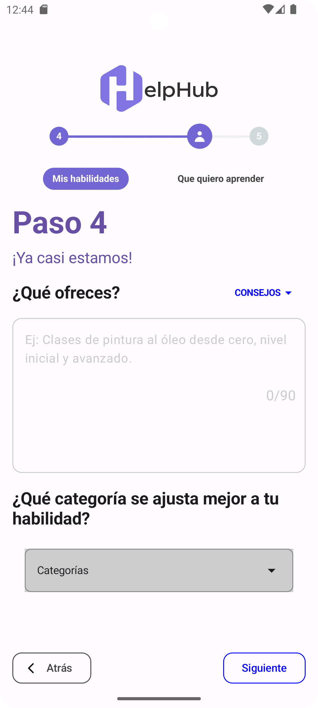
  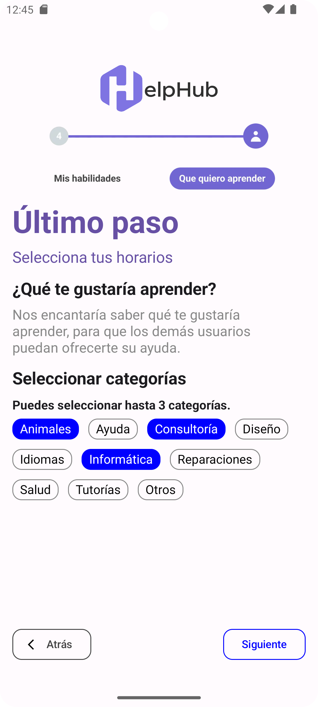

 

    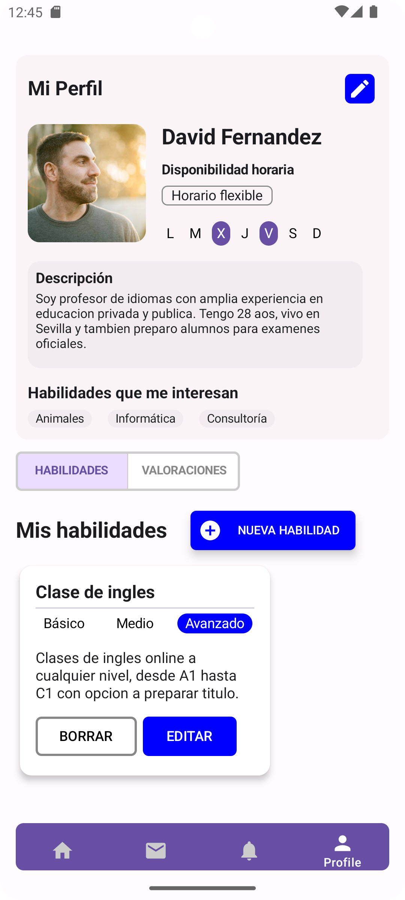

- **Habilidades**: 💡 Los usuarios pueden añadir, editar, listar y eliminar habilidades que desean ofrecer.
  
  

    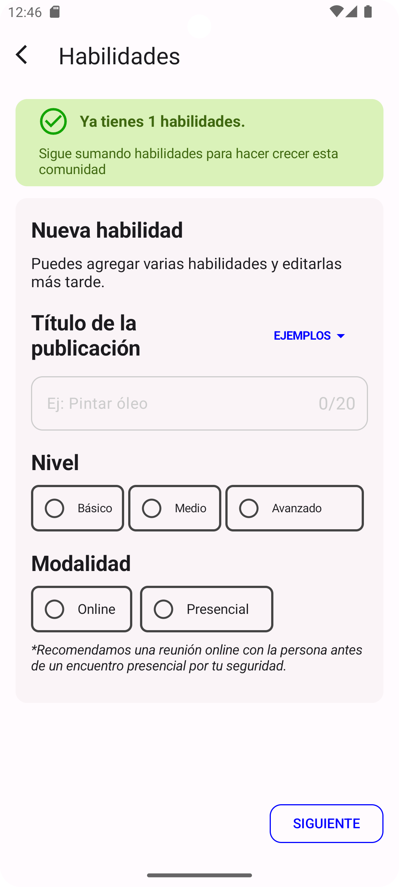
    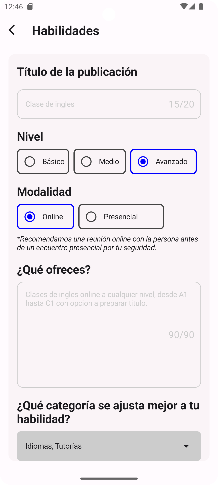

- **Solicitar Intercambio** (TBD): 🤝 Los usuarios pueden enviar solicitudes de intercambio a otros miembros de la plataforma. Sistema de notificaciones para informar al receptor de la solicitud.

- **Petición de Ayuda** (TBD): 🆘 Los usuarios pueden realizar una petición de ayuda si tienen algo específico que quieren resolver sin solicitar un intercambio.

- **Chat en Tiempo Real** (TBD): 💬 Comunicación directa entre usuarios para coordinar los intercambios.

- **Filtrar por Categorías** (On progress): 🔍 Herramienta de búsqueda avanzada para encontrar habilidades o usuarios específicos.

- **Valoración del Intercambio** (TBD): ⭐ Los usuarios pueden añadir una breve reseña describiendo su experiencia y calificando el intercambio.

## ⚙️ Tecnologías y herramientas

    
    
    
    

## ✅ Requisitos previos
Para poder probar la app en tu emulador, necesitarás descargar e instalar el repositorio del equipo de Backend. Accede al repositorio de backend en la sección inferior y sigue las instrucciones de instalación.

## 📦 Dependencias
Este proyecto emplea las siguientes dependencias

- Interfaz de usuario: Jetpack Compose
- Iconos: Material Icons Extended
- Inyección de dependencias: Dagger Hilt
- Comunicación con API: Retrofit
- Interceptores: Okhttp3

## 🎨 Frontend y Backend
Echa un vistazo a los repositorios en:
- 🔐 [Dekstop - HelpHub](https://github.com/AdoptaUnJuniorPlatform/GT-HelpHub-Back)
- 🖥️ [Dekstop - HelpHub](https://github.com/AdoptaUnJuniorPlatform/GT-HelpHub-Front)
- 🤖 [Mobile Android - HelpHub](https://github.com/AdoptaUnJuniorPlatform/GT-HelpHub-Android)
- 🍎 [Mobile IOS - HelpHub](https://github.com/AdoptaUnJuniorPlatform/GT-HelpHub-IOS)

## 🤝 Agradecimientos

Queremos expresar nuestra profunda gratitud a toda la **comunidad de Adopta Un Junior**, quienes hacen posible este proyecto con su apoyo, feedback y compromiso constante.

Un agradecimiento especial a nuestros compañeros del equipo de trabajo HelpHub:
- **Equipo de UX/UI**
- **Equipo de Backend**
- **Equipo de Frontend**
- **Equipo de Mobile iOS**
- **Equipo de Ciberseguridad**  
Cuya colaboración, talento y esfuerzo han sido claves para superar los retos técnicos y llevar este proyecto al siguiente nivel.

## 👨‍💻👩‍💻 Colaboradores
Desarrollado y mantenido por:

- **Alejandro Romero Porras** - Android developer  
  
    

- **María Laura Luraschi** - Cybersecurity Analyst  
  
    
